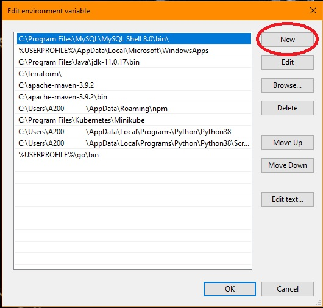

# MilesPlus Automation
## Task Overview
 - To reduce the manual work of converting the miles plus work recording report from "txt" format to "csv", this task has been formulated. The "txt" file had a format consisting of multiple delimeters and had to be arranged into a csv file as per the required format.

## Prerequisites
- On your local machine, you need Python installed and a shell terinal to run the python script for the convertion.

## Preparing your virtual machine
- [python download link](https://www.python.org/downloads/)
- [git bash download link](https://git-scm.com/download/win)

## Setting the appropriate paths for python
There will be two paths that you will have to set
1) For the python.exe file -> set the path of the folder where the python.exe file is present
2) For the "python/scripts" folder

- **Search for variable on your windows machine and click on "Edit the system environment variables"**


- **On "System Properties" window, click on "Environment Variables"**


- **Edit the "path" variable, click on "New" button to add new paths, and add paths for "python.exe" file and "python/scripts" folder**

  

## Setting the http and https proxy 
- Open "Git Bash" and then export the following paths by adding respective user-id and password configured for your windows machine
```sh
export http_proxy=http://<user-id-starting-from-A20******>:<your-machine-password>@10.24.19.83:8080
```
```sh
export https_proxy=http://<user-id-starting-from-A20******>:<your-machine-password>@10.24.19.83:8080
```

## Downloading the modules
Since the script you are about to run, has some modules which needs to be installed before you run the script. Commands for the installation are mentioned below.
```sh
pip3 install openpyxl
```
```sh
pip3 install pandas
```

## The script
As you go inside the milesplus folder, you will see a file "app.py". That's the script conataining the code for the conversion.

## Code Overview
- Initially the required modules are imported.
- After that, source folder's and detination folder's path is set through the arguments passed by the user trough stdin in the command which will start the script.
- Conversion function, which includes the conversion of txt to csv along with splitting the values into extra columns. The function ends by applying the border around the data inside the newly constructed csv file.
- After the conversion is done, user gets informed about the files converted and where the converted files are stored (destination folder).

## How to run the script
This script is kept on a public github repo. Passing the source folder and destination folder path of local file system is neccessary in order to tell the script that where the "txt" files are kept and where to store them after the conversion. Add an extra **"\\"** to both paths. 

### Example:
> cur=l -sS https://raw.githubusercontent.com/bhatanimesh02/miles_plus_automation/main/milesplus/app.py | python - --source "C:\users\source\\\\" --destination "C:\users\destination\\\\"

### Command
```sh
curl -sS https://raw.githubusercontent.com/bhatanimesh02/miles_plus_automation/main/milesplus/app.py | python - --source "<source-folder-path>" --destination "<destination-folder-path>"
```
